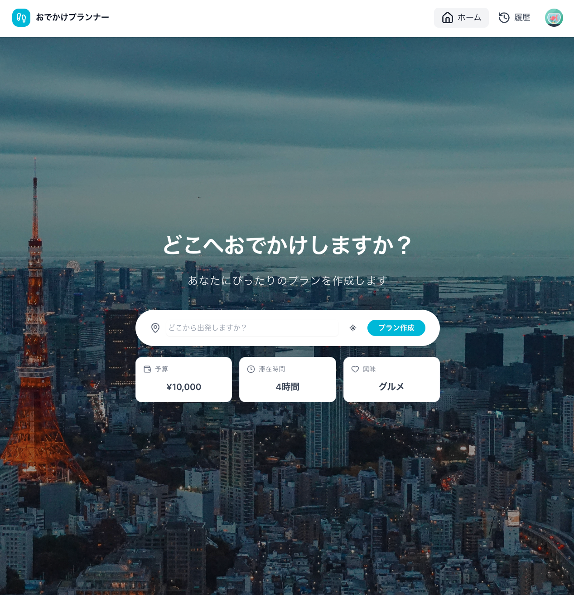
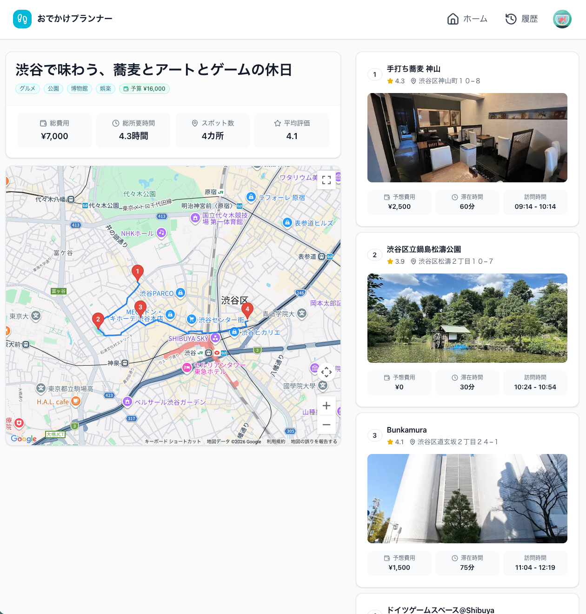

# Outing Plan

**AIエージェントを活用した外出プラン自動生成アプリケーション**

[](https://nextjs.org)
[](https://react.dev)
[](https://www.typescriptlang.org)
[](https://mastra.ai)

---

## デモ

### プラン生成フォーム



### プラン履歴


### プラン詳細・地図表示



---

## 概要

Google Gemini 2.5とMastraによるマルチフェーズAIエージェント処理で、ユーザーの条件（時間・予算・カテゴリ・目的地）に基づいた最適な外出プランを自動生成します。

**プロジェクト規模**: 約10,357行、63ファイル、26コンポーネント

---

## 主な機能

- **AIプラン生成**: マルチフェーズ並列エージェント（スポット収集・選定・スケジュール・コスト・タイトル生成）
- **SSEストリーミング**: プログレス表示付きリアルタイム生成
- **トレンド連動**: Tavilyでエリアの旬な情報をプランに反映（オプション）
- **Google Maps統合**: マーカー・ルート表示、自動ズーム
- **認証・履歴管理**: Supabase Auth、フィルタリング・ソート
- **レート制限**: データベースベース（10req/分）
- **モニタリング**: Langfuseトレーシング

---

## 技術スタック

| カテゴリ           | 技術                                                               |
| ------------------ | ------------------------------------------------------------------ |
| **フロントエンド** | Next.js 16.1 (App Router), React 19, TypeScript 5, Tailwind CSS v4 |
| **バックエンド**   | Next.js API Routes, Prisma 6.19, PostgreSQL (Supabase)             |
| **AI**             | Mastra 1.3, Google Gemini 2.5 Flash-Lite, Langfuse 3.38            |
| **外部API**        | Google Maps/Places/Directions API, Open-Meteo, Tavily (オプション) |

---

## アーキテクチャ

### マルチフェーズAIエージェント処理

```
ユーザー入力
  ↓
バリデーション + レート制限
  ↓
Phase 0: 開始時刻の自動決定（カテゴリ・現在地から推定）
  ↓
Phase 1: データ並列収集（Google Places + Open-Meteo天気 + Tavilyトレンド）
  ↓
Phase 2a: スポット選定エージェント（aliasレジストリで長ID除去）
  ↓
Phase 2b: タイミング + コストエージェント（並列実行）
  ↓
Phase 3: コード組み立て + Zod検証 + タイトル生成 → DB保存
```

---

## 技術的特徴

### 型安全性

- TypeScript strict mode + Zod（リクエスト、フォーム、AIレスポンス）

### セキュリティ

- セキュリティヘッダー、Supabase Auth (JWT + RLS)、Open Redirect対策

### AI統合

- 並列マルチフェーズ処理・Alias Registryでハルシネーション防止、フォールバック機構、Langfuseトレーシング

### パフォーマンス

- SSR、動的インポート、メタデータ最適化

### コード品質

- ESLint + Prettier、Huskyでコミット前自動チェック

---

## セットアップ

### 前提条件

- Node.js v20+、Supabase/Google Cloud/Langfuseアカウント

### 手順

```bash
git clone https://github.com/lamb48/outing-plan.git
cd outing-plan
npm install
cp .env.example .env.local  # APIキーを設定
npx prisma generate
npx prisma migrate dev
npm run dev  # http://localhost:3000
```

### 環境変数

`.env.local` に以下を設定:

- `DATABASE_URL`, `NEXT_PUBLIC_SUPABASE_URL`, `NEXT_PUBLIC_SUPABASE_ANON_KEY`
- `GOOGLE_PLACES_API_KEY`, `NEXT_PUBLIC_GOOGLE_MAPS_API_KEY`
- `NEXT_PUBLIC_GA4_MEASUREMENT_ID`
- `GOOGLE_GENERATIVE_AI_API_KEY`
- `TAVILY_API_KEY` (オプション)
- `LANGFUSE_SECRET_KEY`, `LANGFUSE_PUBLIC_KEY` (オプション)

---

## プロジェクト構成

```
app/          # Next.js App Router (ページ・API Routes)
components/   # Reactコンポーネント (plan/, layout/, ui/, analytics/)
lib/          # ライブラリ (mastra/, supabase/, prisma.ts)
hooks/        # カスタムフック
prisma/       # データベーススキーマ
```

---

## 開発

```bash
npm run dev      # 開発サーバー
npm run build    # ビルド
npm run lint     # ESLint
npm run format   # Prettier
```

---

**GitHub**: [@lamb48](https://github.com/lamb48)
